# How `/liberate` Works

This document explains the end-to-end **liberate** process: pointing the tool at a closed-platform website (Wix, Squarespace, Shopify, …) and producing a faithful, editable **WordPress block-theme replica** plus a portable WXR/Woo export.

It is built from two cooperating layers:

- a **deterministic core** — plain TypeScript MCP tools and pure functions that do the precise, repeatable work (fetch, extract, render, gate, score), and
- an **AI orchestration layer** — Claude Code skills where an agent makes judgments (interpreting section structure, choosing block types, visual QA) and sequences the deterministic tools.

> Derived from the code as of 2026-05-27. The page-content path documented here is the current **per-page `liberate_reconstruct_pages`** flow. An older **cluster-skeleton + `compose_instantiate`** path still exists in `skills/liberate/SKILL.md` (steps 8–11) but is superseded for page *content*; clustering still earns its keep for sitewide-chrome dedup and posts/products templates.

## Conventions

Every diagram uses the same visual language:

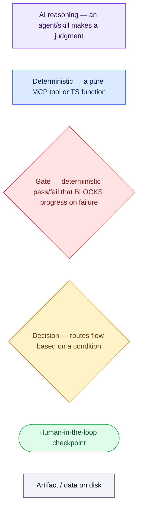

- **Parallel work** is drawn inside a subgraph whose title names the concurrency.
- Two **gates are security/quality trust boundaries** and reappear throughout: `validate_artifacts` (escaping + injection + provenance) and the `@390px` responsiveness check.

## Contents

1. [The big picture — two phases](#1-the-big-picture--two-phases)
2. [Platform detection (decision tree)](#2-platform-detection-decision-tree)
3. [The extraction loop (parallelism + decisions)](#3-the-extraction-loop-parallelism--decisions)
4. [Shopify product path (decision tree)](#4-shopify-product-path-decision-tree)
5. [Screenshot capture + design-token aggregation (parallel)](#5-screenshot-capture--design-token-aggregation-parallel)
6. [The design contract — foundation + theme scaffold](#6-the-design-contract--foundation--theme-scaffold)
7. [Clustering + the parallel build fan-out](#7-clustering--the-parallel-build-fan-out)
8. [Section → block-template routing (decision tree)](#8-section--block-template-routing-decision-tree)
9. [Per-page reconstruction + the artifacts gate](#9-per-page-reconstruction--the-artifacts-gate)
10. [The QA loop (deterministic gates, AI verdicts)](#10-the-qa-loop-deterministic-gates-ai-verdicts)
11. [Archetype routing (decision tree)](#11-archetype-routing-decision-tree)
12. [Resume state + artifact handoffs](#12-resume-state--artifact-handoffs)

---

## 1. The big picture — two phases

The agent is the conductor: it narrates, sequences, and makes judgments, but each numbered step below is either a deterministic tool call or an inline AI sub-skill. **Phase 1 (Liberate)** pulls content out into portable form; a **human confirm checkpoint** gates spend; **Phase 2 (Replicate)** rebuilds the site as a block theme.

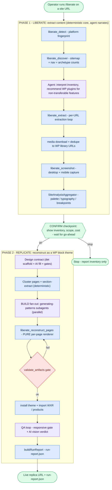

The single most important AI/deterministic boundary: **the renderer (`page-reconstruct.ts`) is pure** — specs in, gated block markup out, fully unit-tested. AI judgment lives on *both sides* of it (section interpretation upstream, visual QA downstream), never inside it.

---

## 2. Platform detection (decision tree)

`liberate_detect` walks four tiers from cheapest to most invasive, stopping at the first hit. URL and HTTP-header matches are high-confidence; HTML markers are medium; active path probes are a last resort. No match means no adapter, which is a hard stop.

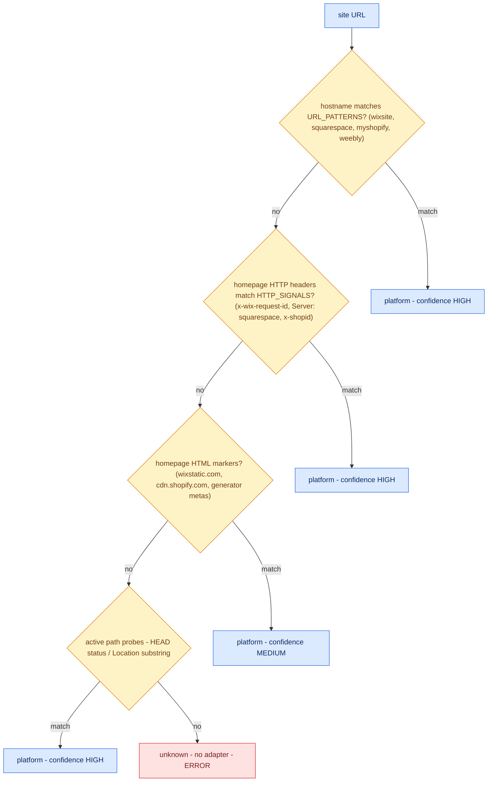

---

## 3. The extraction loop (parallelism + decisions)

`liberate_extract` is bracketed by a PID lockfile so only one run touches an output directory at a time. Page **fetches run in parallel** (an adaptive tuner picks 1–3 concurrent based on observed latency), but **per-page writes are sequential** because the WXR builder and the append-only log are single-writer. Media downloads fan out again into concurrent chunks (start 6, range 1–12, AIMD-tuned).

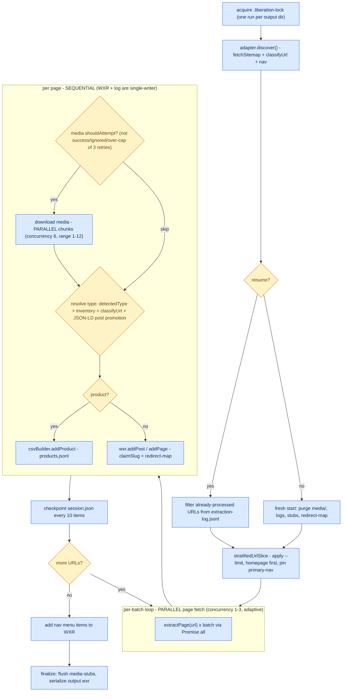

`classifyUrl` is the type decision feeding `j`: `/` → `homepage`; `blog|post|article|news|journal` paths → `post`; `products|store|shop` → `product`; `gallery|portfolio` → `gallery`; `event(s)` → `event`; everything else → `page`. Same-origin is enforced on every fetched URL and re-validated on each media redirect (SSRF guard).

---

## 4. Shopify product path (decision tree)

Shopify is the one adapter with two extraction strategies. With an admin token against a `*.myshopify.com` host it uses the Admin GraphQL API (resumable via `endCursor`); otherwise it falls back to the public JSON API + URL loop. Any GraphQL failure also falls back. Sale pricing is derived from `compareAtPrice` semantics.

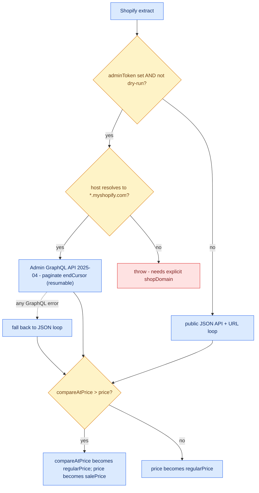

GraphQL pagination is sequential with two guards: `MAX_PAGES = 10000` and a non-advancing-cursor check, both of which throw rather than loop forever.

---

## 5. Screenshot capture + design-token aggregation (parallel)

When screenshots are enabled (CLI default; `liberate_screenshot` opt-in via MCP), URLs are captured in parallel batches of 6 (clamped to 1–10). The Playwright browser is restarted every 100 URLs — but only at batch boundaries — to bound memory. After all captures, a single aggregation pass derives the site-wide design tokens.

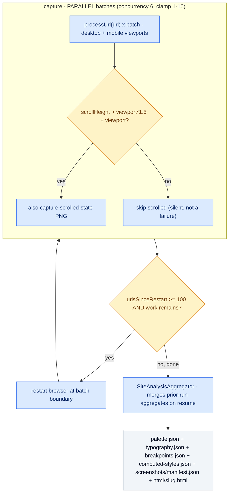

Cross-origin stylesheets are skipped silently during analysis (their `cssRules` throw); same-origin CSS contributes. The `manifest.json` is the filesystem-only join key between a URL and its screenshots/HTML — nothing is injected back into the WXR.

---

## 6. The design contract — foundation + theme scaffold

This is where the **site-wide visual contract** is frozen. A deterministic scaffold pre-fills the obvious token roles from the aggregates; the `design-foundations` **AI skill** fills the judgment roles (accent, muted text, display font, gradient roles) from HTML+CSS evidence; a validate gate refuses to proceed while any required role is still null. The frozen `design.md` becomes immutable downstream (only a late QA iteration may amend it — see §10). The theme scaffold itself is explicitly pure (no vision, no reasoning) and is guarded by a theme.json lint gate.

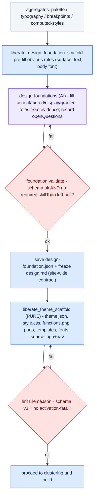

If a source font is commercial/uncapturable, the deterministic pipeline auto-substitutes a free font and records an `openQuestion` rather than failing or guessing.

---

## 7. Clustering + the parallel build fan-out

This is the **only true multi-agent parallel step**. Pages are grouped by exact layout signature and the richest representative per cluster is extracted in full (computed styles, interaction model, verbatim text, media URLs, and CSS-geometry **layout signals** — see §9). Then one `generating-patterns` **subagent per cluster representative** runs concurrently (cap ~4–6) to produce section block-skeletons. The fan-out is safe because subagents are **read-only** — they receive paths and return strings; only the orchestrator writes to disk.

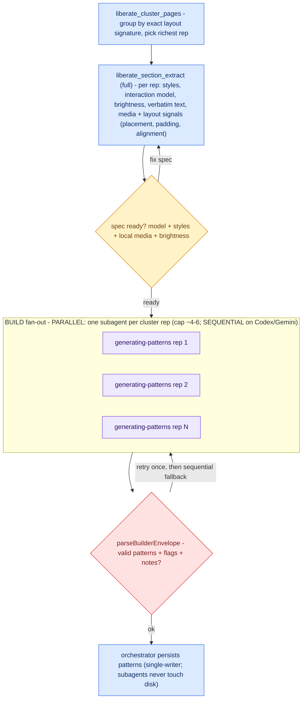

The macro-pipeline is otherwise strictly sequential: each stage consumes the prior stage's artifact, and the single-writer `session.json` (atomic rename) serializes cluster persistence even though builders run in parallel.

---

## 8. Section → block-template routing (decision tree)

Inside each builder, every captured section is matched against the `section-mapping.md` template catalog by its interaction model. A match yields a specific, high-fidelity template; **no match falls back to a faithful generic layout** (`columns`/`group`) plus a run-report flag — a section is never forced into the wrong specific template.

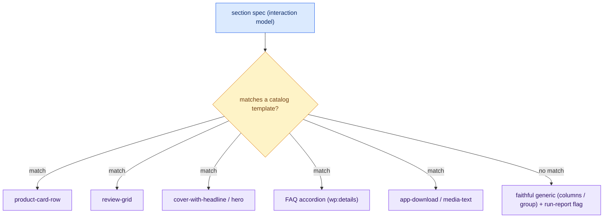

---

## 9. Per-page reconstruction + the artifacts gate

`liberate_reconstruct_pages` reconstructs **every content page from its own specs** (not just cluster reps) using the pure `page-reconstruct.ts` renderer, and gates each page through `validate_artifacts` before it is kept. Layout is **CSS-geometry-driven and deterministic** — section-extract measures bounding boxes and computed styles to record image-beside-text placement (`mediaLayout` image-left/right), geometric inner padding, and content/icon alignment, and the renderer reproduces those (e.g. a 2-column media-text row) instead of defaulting to a stack. Missing media becomes a sized placeholder + provenance flag; copy that is not present verbatim in the spec is omitted or marked — **never paraphrased**, because the provenance check hard-fails invented prose.

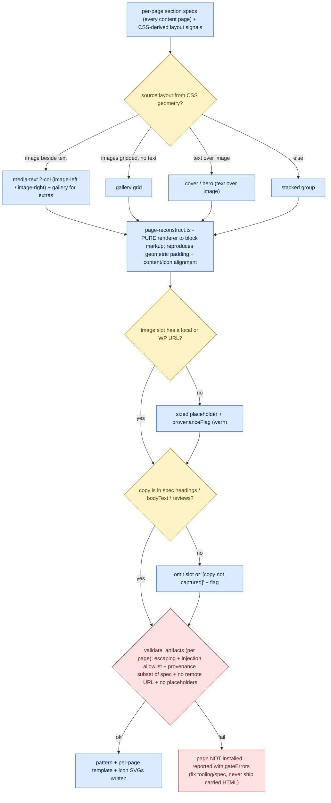

`validate_artifacts` runs **twice**: once per page here, and again as the standalone pre-install gate. It is the single trust boundary against prompt-injection from source content and AI-invented copy. (This is also the gate now reinforced by the official-WP-parser block-markup structural check.)

---

## 10. The QA loop (deterministic gates, AI verdicts)

After install, QA alternates **deterministic gates** with **AI judgment**. The `@390px` responsiveness check is a hard pass/fail function; pixel-diff is a *signal only*; the qualitative A/B/C verdict is AI vision. Fixes are AI edits. The loop is capped at 3 iterations per archetype; a third iteration may amend the frozen `design.md`, which cascades a full rebuild.

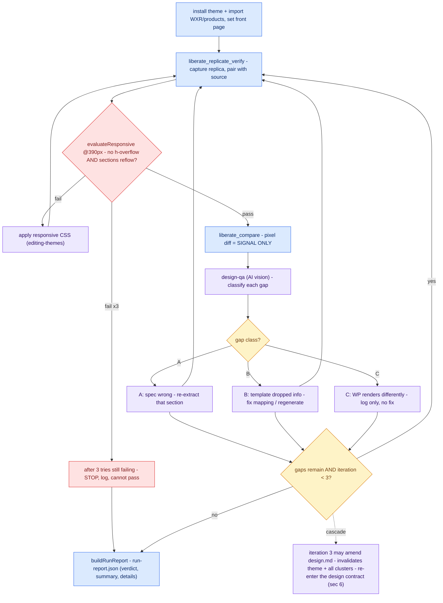

A page that fell back to a carried `wp:post-content` block is an automatic **C/FAIL**, never "pass-with-notes" — the whole point is faithful reconstruction. A separate **budget guard** can pause at any checkpoint and ask the operator to continue / stop / raise the ceiling when subagent, cluster, or elapsed-time limits are hit.

---

## 11. Archetype routing (decision tree)

Not everything is reconstructed page-by-page. Only homepage and standalone pages get per-page section reconstruction; posts and products are handled by **WordPress-native templates + loops**, so a 500-post blog produces two templates rather than 500 reconstructions.

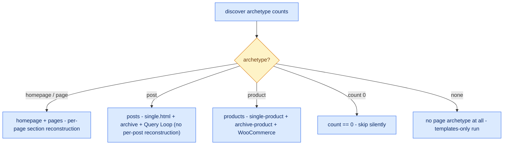

---

## 12. Resume state + artifact handoffs

### Resume is filesystem state, not memory

Four cooperating files make a run resumable; together they let any stage pick up where a crash left off (see `CLAUDE.md` for the authoritative contract):

| File | Role | Resume behavior |
|---|---|---|
| `extraction-log.jsonl` | append-only per-URL dedupe | source of truth for "did we process this URL" |
| `session.json` | stage, opts, counts, adapter cursors | single-writer, atomic rename; corrupt files quarantined |
| `media-stubs.json` | per-asset status + retry cap (3) | failures persist immediately; successes buffered |
| `products.jsonl` | streaming Woo output | appended (not truncated) on resume |

### What passes between AI and deterministic steps

The arrows below are the **handoffs** — and the two frozen contracts where an AI judgment becomes immutable downstream input.

```mermaid
flowchart LR
    disc["discover inventory"]:::det --> conf(["AI confirm"]):::human
    ext["extract"]:::det --> wxr["output.wxr + media (WP URLs) + products.jsonl"]:::art
    shot["screenshot + aggregate"]:::det --> tok["palette/typography/breakpoints/computed-styles + html/slug.html"]:::art

    tok --> found["design-foundations (AI fill + gates)"]:::ai
    found --> dm["design.md + design-foundation.json  [FROZEN CONTRACT]"]:::art
    dm --> theme["theme scaffold + lint gate"]:::det --> bundle["theme bundle"]:::art

    bundle --> spec["section-extract (full)"]:::det --> specs["specs/rep/section-N.md  [EXTRACTION->BUILD CONTRACT]"]:::art
    specs --> gen["generating-patterns (AI, parallel)"]:::ai --> rpages["reconstruct_pages (pure)"]:::det
    rpages --> gate{"validate_artifacts"}:::gate --> live["install -> live Studio/Playground replica"]:::art
    live --> qa["replicate_verify + responsive gate + AI vision QA"]:::ai --> rep["run-report.json + replica URL"]:::art

    classDef ai fill:#ede9fe,stroke:#7c3aed,color:#2e1065;
    classDef det fill:#dbeafe,stroke:#2563eb,color:#0c2a66;
    classDef gate fill:#fee2e2,stroke:#dc2626,color:#7f1d1d;
    classDef human fill:#dcfce7,stroke:#16a34a,color:#14532d;
    classDef art fill:#f1f5f9,stroke:#64748b,color:#0f172a;
```

The **two frozen contracts** are where AI judgment hardens into deterministic input: `design.md` (only a QA-iteration-3 amendment can change it, at the cost of a full rebuild) and the per-rep `specs/*.md` files (the extraction→generation handshake).

**Final deliverables:** a running Studio/Playground replica at a local URL, and `run-report.json` — a verdict-first report whose per-page grades and gaps are produced by the deterministic `buildRunReport`.
