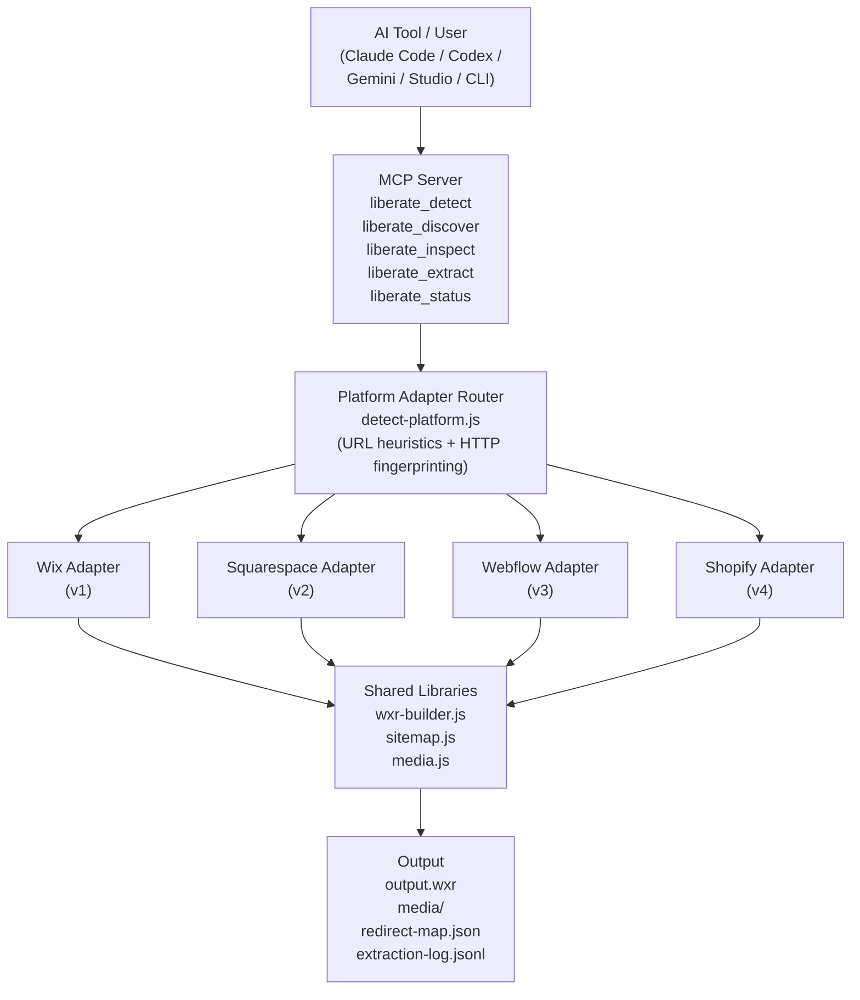
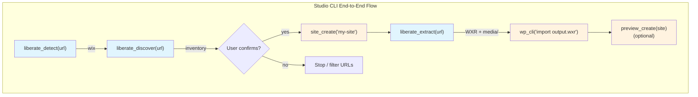

# Data Liberation Plugin Design

## Overview

An AI tool plugin (with MCP server and standalone CLI) that extracts content from closed web platforms and produces WordPress-compatible WXR export files. Works with Claude Code, Codex, and Gemini CLI. The plugin handles extraction only — WordPress import is handled by Studio CLI or any WordPress importer.

Launches with Wix support. Squarespace, Webflow, and Shopify (blog/pages) follow as subsequent adapters — the architecture supports them but they're not required for v1.

## Decisions

| Decision | Choice | Rationale |
|---|---|---|
| Where it lives | Standalone plugin, Studio consumes via MCP | Decouples extraction releases from Studio. Works across all AI tools and standalone. |
| Output format | WXR + media directory + redirect map | WordPress standard import format. Works with `wp import`, any WordPress site. |
| Content scope | Pages, posts, media, categories, tags, menus, SEO metadata | Content only. No design/theme extraction. |
| Content markup | Clean semantic HTML | No Gutenberg block conversion. WordPress imports HTML fine. |
| Authentication | API tokens as flags, browser session as bonus path | Tokens are universal. CDP/cookie access is a bonus for Wix and Squarespace where the user's browser is already logged in. |
| Plugin boundary | Extraction only | Studio CLI handles site creation, WP-CLI import, preview publishing. |
| SEO metadata | Generic custom fields (`_seo_title`, `_seo_description`) | Studio or the user maps to their chosen SEO plugin (Yoast, Rank Math, etc.) post-import. |
| WXR generation | Custom wxr-builder library | No mature JS WXR library exists. The format is simple RSS 2.0 with WordPress namespaces. ~200 lines. |
| Schema versioning | Additive-only | Never remove or rename fields in MCP tool return schemas, only add new ones. Avoids breaking Studio or other consumers. |
| Adapter registration | Static imports | MCP server imports all adapters explicitly. Adding an adapter means editing one import line. |
| Extraction log format | JSONL (one JSON object per line) | Crash-safe on Ctrl+C. Incomplete last lines are trivially detectable and skippable on resume. |
| Long-running MCP tools | Blocking call with progress logging | `liberate_extract` blocks until complete, sends progress via `server.sendLoggingMessage()`. Matches Studio's `preview_create` pattern. |
| Concurrent extraction guard | Lock file in outputDir | Prevents garbled output from two extractions to the same directory. Lock includes PID for stale lock detection. |
| v1 adapter scope | Only Wix adapter file exists | v2-v4 adapter files are not created until their respective phases. `mcp-server.js` imports only `wix.js` in v1. |

## Architecture





Steps 1-4 (blue) use data-liberation tools. Steps 5-6 (orange) use Studio tools. Clean boundary.

## Surface Area

### Three entry points, one codebase

**AI tool plugin** — provides skills, slash commands, and MCP tools. Each AI tool discovers the plugin through its own mechanism:
- **Claude Code:** `.claude-plugin/plugin.json` — install via `claude plugin add`
- **Codex:** `codex mcp add data-liberation` — registers the MCP server
- **Gemini CLI:** MCP server config in `.gemini/settings.json`

The plugin ships all three registration formats. The skills, commands, and tools are the same regardless of which AI tool loads them.

**MCP server** — `npx data-liberation mcp`. Studio CLI and any MCP-compatible AI tool can register this as a tool provider.

**Standalone CLI** — `npx data-liberation <url>`. For users who want WXR output without any AI tool.

### MCP Tools

| Tool | Purpose |
|---|---|
| `liberate_detect` | Given a URL, detect the platform via URL heuristics and HTTP response fingerprinting. |
| `liberate_discover` | Inventory a site: fetch sitemap, categorize URLs, extract navigation. |
| `liberate_inspect` | Probe a site's extractability: detect platform, fetch sitemap, probe 2-3 pages for available data sources. |
| `liberate_extract` | Extract all content from a discovered site. Produces WXR + media directory + redirect map. Supports `resume` and `dryRun` options. Blocks until complete, sends progress via MCP logging. |
| `liberate_status` | Check progress of a running extraction (when called from a separate MCP session). |

### Tool Return Schemas

All tools return `content: [{ type: 'text', text: <JSON string> }]` per MCP convention. The JSON shapes are:

**`liberate_detect` returns:**
```
{
  url: string,
  platform: 'wix' | 'squarespace' | 'webflow' | 'shopify' | 'unknown',
  confidence: 'high' | 'medium' | 'low',
  signals: string[]           // e.g. ["X-Wix-Request-Id header", "wixstatic.com in page source"]
}
```

**`liberate_discover` returns:**
```
{
  siteUrl: string,
  platform: string,
  urls: Array<{ url: string, type: string }>,
  navigation: Array<{ text: string, href: string, children?: [] }>,
  siteMeta: { title: string, tagline?: string, language?: string },
  counts: Record<string, number>
}
```

**`liberate_inspect` returns:**
```
{
  url: string,
  platform: string,
  confidence: string,
  signals: string[],
  sitemapFound: boolean,
  urlCount: number,
  counts: Record<string, number>,
  probeResults: Array<{
    url: string,
    dataSources: string[],     // e.g. ["apiCalls: 12", "globals: 5", "jsonLd: 2"]
    contentFound: boolean,
    mediaCount: number
  }>,
  authRequired: boolean,
  extractionFeasibility: 'ready' | 'needs-auth' | 'needs-browser' | 'limited'
}
```

**`liberate_extract` returns:**
```
{
  wxrPath: string,
  redirectMapPath: string,
  outputDir: string,
  summary: {
    pagesExtracted: number,
    postsExtracted: number,
    mediaDownloaded: number,
    mediaFailed: number,
    categoriesFound: number,
    tagsFound: number,
    menuItemsFound: number,
    failedUrls: number,
    qualityScores: {
      high: number,            // pages with title + content + date
      medium: number,          // pages missing one of the above
      low: number              // pages with minimal extractable content
    }
  },
  failures: Array<{ url: string, error: string }>,
  wxrValidation: {
    valid: boolean,
    warnings: string[]         // e.g. ["3 posts reference non-existent media IDs"]
  },
  dryRun: boolean
}
```

**`liberate_status` returns:**
```
{
  running: boolean,
  processed: number,
  remaining: number,
  failed: number,
  currentUrl?: string,
  elapsedMs?: number,
  estimatedRemainingMs?: number
}
```

### Skills

| Skill | Purpose |
|---|---|
| `/liberate` | Full orchestrated workflow: detect, discover, show inventory, confirm with user, extract, report results. |

## Platform Detection

Platform detection uses a two-tier approach:

**Tier 1 — URL heuristics (instant, no network):**
Check if the URL contains known platform domains (`wixsite.com`, `squarespace.com`, `webflow.io`, `myshopify.com`).

**Tier 2 — HTTP fingerprinting (one request):**
For custom domains where heuristics fail, fetch the URL and check:

| Platform | Signal |
|---|---|
| Wix | `X-Wix-Request-Id` header, `wixstatic.com` in page source |
| Squarespace | `X-ServedBy: squarespace` header |
| Webflow | `X-Powered-By: Webflow` header |
| Shopify | `X-ShopId` header, `cdn.shopify.com` in page source |

If no signal matches, return `platform: 'unknown'` with `confidence: 'low'`.

## Platform Adapter Interface

Each platform implements an adapter with one property and three methods:

```
interface PlatformAdapter {
  id: string                    // 'wix' | 'squarespace' | 'webflow' | 'shopify'
  detect(url: string): boolean  // can this adapter handle this URL?

  discover(url: string, opts: DiscoverOpts): Promise<Inventory>
  extract(inventory: Inventory, wxr: WxrBuilder, opts: ExtractOpts): Promise<ExtractionLog>
}
```

The MCP server imports adapters via static imports. In v1, only the Wix adapter is imported. Future adapters are added by creating the adapter file and adding one import line in `mcp-server.js` — adapter files are not created until their phase.

### Inventory shape

Returned by `discover()`:

```
Inventory {
  siteUrl: string
  platform: string
  urls: Array<{ url: string, type: 'page' | 'post' | 'product' | 'event' | ... }>
  navigation: Array<{ text: string, href: string, children?: [] }>
  siteMeta: { title: string, tagline?: string, language?: string }
  counts: Record<string, number>
}
```

### ExtractionLog shape

Returned by `extract()`. The log is written incrementally as a JSONL file (one JSON object per line) during extraction, making it crash-safe on Ctrl+C. Incomplete last lines are detected and skipped on resume.

```
ExtractionLog {
  processed: Array<{ url: string, slug: string, timestamp: string, durationMs: number, qualityScore: 'high' | 'medium' | 'low' }>
  failed: Array<{ url: string, error: string, timestamp: string }>
  mediaDownloaded: Array<{ url: string, localPath: string }>
  mediaFailed: Array<{ url: string, error: string }>
  wxrPath: string
  redirectMapPath: string
  outputDir: string
}
```

**Quality scoring:** Each extracted page receives a quality score based on data completeness:
- **high** — has title, body content, and publish date
- **medium** — missing one of the above
- **low** — minimal extractable content (e.g., only a title, or only an accessibility tree)

The extraction summary reports the distribution of quality scores so the user knows what to review after import.

### Shared options

```
DiscoverOpts {
  token?: string        // API token (Webflow, Shopify)
  cdpPort?: number      // connect to existing browser (Wix)
  userAgent?: string    // match real browser UA
  verbose?: boolean     // detailed per-page extraction logging
}

ExtractOpts extends DiscoverOpts {
  delay?: number        // ms between requests (default: 500)
  resume?: boolean      // skip already-extracted URLs
  dryRun?: boolean      // extract 2-3 pages, report findings, stop
  limit?: number        // cap for testing
  outputDir: string     // where to write WXR + media
}
```

### Platform-specific strategies

| Platform | discover() | extract() | Auth | Needs browser? |
|---|---|---|---|---|
| **Wix** | Sitemap XML + homepage crawl for nav | Playwright: intercept internal JSON APIs (`/_api/*`, `wixapis.com`), extract window globals (`__WIX_DATA__`, JSON-LD), download media | CDP browser session (cookies) | Yes |
| **Squarespace** | Sitemap XML + nav from homepage | Fetch each URL with `?format=json` suffix, parse structured JSON response | None for public content | No |
| **Webflow** | Sitemap XML + CMS API for collection item URLs | CMS REST API for dynamic content, fetch static pages as HTML and parse with DOM | API token (flag) | No |
| **Shopify** | Sitemap XML (sub-sitemaps for blogs, pages) | Admin REST/GraphQL API for articles, pages, assets. Storefront JSON (`/pages.json`, `/blogs.json`) as fallback | Admin API token (flag) | No |

Only the Wix adapter requires Playwright. The others use Node's built-in `fetch`.

## WXR Builder

A small library (~200 lines) that builds valid WXR 1.2 XML incrementally. Adapters call its methods during extraction. Content is accumulated in memory, validated, then serialized.

### API

```
class WxrBuilder {
  constructor(siteMeta: { title: string, url: string, description?: string, language?: string })

  addAuthor(author: { login: string, email?: string, displayName?: string }): number
  addCategory(cat: { slug: string, name: string, parent?: string }): number
  addTag(tag: { slug: string, name: string }): number
  addMedia(media: { url: string, localPath: string, title?: string, altText?: string, caption?: string }): number
  addPage(page: { title: string, slug: string, content: string, excerpt?: string, date?: string, parent?: number, menuOrder?: number, seoTitle?: string, seoDescription?: string }): number
  addPost(post: { title: string, slug: string, content: string, excerpt?: string, date?: string, categories?: string[], tags?: string[], featuredMediaId?: number, author?: string, seoTitle?: string, seoDescription?: string }): number
  addMenuItem(item: { title: string, url: string, menuSlug: string, parent?: number, order?: number }): void
  addRedirect(redirect: { from: string, to: string }): void

  validate(): { valid: boolean, warnings: string[] }
  serialize(outputPath: string): void
}
```

Each `add*` method returns an auto-incrementing integer ID. This is how adapters link entities — `addMedia()` returns an ID that gets passed as `featuredMediaId` to `addPost()`.

### Validation

`validate()` checks referential integrity before serialization:
- All `featuredMediaId` references point to media items that were actually added
- All category/tag references in posts match added categories/tags
- Flags posts/pages with empty content
- Verifies the XML is well-formed

`serialize()` calls `validate()` automatically and includes warnings in the extraction summary. Validation issues are warnings, not errors — the WXR is still written.

### Content format

The `content` field is clean semantic HTML: `<h2>`, `<p>`, ``, `<ul>`, `<blockquote>`, etc. No Gutenberg block markup. WordPress imports HTML content without issue.

### Media handling

`addMedia()` takes both `url` (original source) and `localPath` (downloaded file on disk). Adapters download media during extraction into `outputDir/media/`.

**Filename collision handling:** When two different images have the same filename, the media downloader appends a sequential suffix: `image.jpg`, `image-2.jpg`, `image-3.jpg`. This matches WordPress's own convention for media uploads.

The WXR references the original URL — WordPress's importer can re-download it, or Studio can upload from the local files directly.

### Redirect map

`addRedirect()` records a source URL → destination slug mapping. During `serialize()`, the builder writes a `redirect-map.json` alongside the WXR file:

```
[
  { "from": "/old-wix-path", "to": "/new-wp-slug" },
  ...
]
```

Adapters call `addRedirect()` for each extracted page/post, mapping the original platform URL path to the WordPress slug. The user or Studio uses this to configure 301 redirects after import.

### SEO metadata

Stored as post meta in the WXR using generic custom field names:
- `_seo_title`
- `_seo_description`

Studio or the user maps these to their SEO plugin's expected keys (Yoast, Rank Math, AIOSEO, etc.) as a post-import step.

## File Structure

```
data-liberation/
├── .claude-plugin/
│   └── plugin.json              # Claude Code plugin manifest
├── codex.md                     # Codex plugin instructions (optional)
├── skills/
│   └── liberate/
│       └── SKILL.md             # /liberate workflow orchestration
├── commands/
│   └── liberate.md              # slash command definition
├── src/
│   ├── adapters/
│   │   └── wix.js               # browser-based extraction (v1 — other adapters added in later phases)
│   ├── lib/
│   │   ├── wxr-builder.js       # WXR XML builder + validator
│   │   ├── detect-platform.js   # URL heuristics + HTTP fingerprinting
│   │   ├── sitemap.js           # shared sitemap fetcher/parser
│   │   └── media.js             # shared media downloader (with collision handling)
│   ├── mcp-server.js            # MCP tool definitions (static adapter imports)
│   └── cli.js                   # standalone CLI entry point
├── test/
│   ├── fixtures/                # recorded Wix API responses + page snapshots
│   ├── wxr-builder.test.js
│   ├── detect-platform.test.js
│   ├── sitemap.test.js
│   ├── media.test.js
│   ├── adapters/
│   │   └── wix.test.js          # integration tests using fixtures
│   └── canary/
│       └── wix-live.test.js     # live site test (manual/scheduled only)
├── package.json
├── AGENTS.md                    # instructions for AI agents
├── CONTRIBUTING.md              # how to contribute discoveries
├── DISCOVERIES.md               # log of community findings
├── TODOS.md                     # deferred work items
└── README.md
```

### Dependencies

- `playwright` — optional dependency, required only by the Wix adapter. If not installed, Wix extraction fails gracefully with a message to install it. Note: Playwright downloads Chromium (~200MB) on first install — document this clearly.
- `@modelcontextprotocol/sdk` — for the MCP server.
- No other runtime dependencies. Squarespace, Webflow, and Shopify adapters use Node's built-in `fetch` (Node 18+).

## Security

**Token redaction:** API tokens (Webflow, Shopify) must never appear in logs, extraction log files, error messages, or MCP tool responses. The `token` field is stripped from any object before logging or returning. Adapters must not log the full `opts` object.

**Path traversal guard:** `media.js` must resolve the final file path and verify it starts with `outputDir` before writing. This prevents crafted URLs (e.g., `/../../etc/passwd`) from writing outside the output directory.

**Credential handling:** Tokens are passed as flags and held in memory only for the duration of the extraction. They are not written to disk.

## Studio CLI Integration

Studio CLI registers the data-liberation MCP server as a tool provider. Studio's system prompt gains a liberation workflow section.

### Studio's responsibilities post-import

- SEO field mapping (generic `_seo_*` fields → plugin-specific meta keys)
- Block conversion if desired (HTML → Gutenberg blocks)
- Theme recommendation based on the imported content
- Preview publishing to WordPress.com
- Redirect configuration from redirect-map.json

These are all optional post-import enhancements, not part of the liberation plugin.

## Extraction Resilience

### Resume support

`liberate_extract` writes an `extraction-log.jsonl` (JSONL format — one JSON object per line) incrementally as it processes URLs. Each successfully extracted URL is appended as a complete line. When called with `resume: true`, it reads all complete lines from the log and skips those URLs. Incomplete last lines (from Ctrl+C during a write) are detected and ignored.

### Dry-run mode

`liberate_extract` with `dryRun: true` extracts the first 2-3 pages, reports what data was found (API calls intercepted, globals found, content fields populated, media URLs detected), then stops without writing WXR. This lets the user/agent verify extraction will work before committing to a full run.

### Rate limiting

Each adapter manages its own pacing:

| Platform | Strategy |
|---|---|
| Wix | Configurable delay between page loads (default 500ms), exponential backoff on 429s |
| Squarespace | Delay between `?format=json` fetches (default 500ms), backoff on 429s |
| Webflow | Respect 60 req/min API limit, request queue with backoff |
| Shopify | Respect 2 req/sec leak rate, request queue with backoff |

### Progress reporting

`liberate_status` reads the current extraction log and returns a structured summary: URLs processed, URLs remaining, current URL, failures with error messages, elapsed time, and estimated remaining time.

### Failure handling

- Individual URL failures do not stop extraction. They're logged with the error and URL.
- The final output includes a failures summary with quality score distribution.
- Media download failures are non-fatal: the WXR still references the original URL and WordPress's importer can attempt to fetch it.
- Disk full errors (IOError) are caught and reported with a clear message: "Disk full — free space and re-run with --resume."

### Concurrency guard

Before extraction starts, `liberate_extract` creates a `.liberation-lock` file in `outputDir` containing the process PID and start timestamp. If the lock file already exists, extraction aborts with "Extraction already in progress." The lock is removed on completion or via `process.on('exit')`. Stale locks (where the PID is no longer running) are detected and removed automatically.

### Progress logging

`liberate_extract` blocks the MCP tool call until extraction completes. During execution, it sends progress updates via `server.sendLoggingMessage()` (built-in MCP capability). Progress messages include: current URL, pages processed / total, elapsed time, and estimated remaining time. The AI agent can relay these to the user.

### Verbose mode

When `verbose: true` is set in options, adapters log detailed per-page extraction information: which data sources were tried (API calls, window globals, JSON-LD, accessibility tree), which succeeded, which were empty, and what content was extracted. This is essential for debugging extraction issues.

## Test Strategy

### Fixture-based CI tests

The Wix adapter's tests use recorded fixtures — real Wix API responses and page snapshots captured during manual testing. Tests replay these via Playwright's `page.route()` to serve fixture files. Tests are deterministic, fast, and run on every commit.

Shared libraries (wxr-builder, detect-platform, sitemap, media) have unit tests with synthetic inputs.

### Live canary tests

A separate test suite (`test/canary/`) runs against a known public Wix site. Slow and potentially flaky — run manually or on a weekly schedule, not on every commit. These detect when Wix changes internal APIs or page structure.

### Test pyramid

- **Many unit tests:** wxr-builder, platform detection, sitemap parsing, media downloading, JSONL log handling, filename collision, quality scoring, WXR validation
- **Fewer integration tests:** Wix adapter end-to-end with fixtures
- **No E2E tests:** No UI to test

## Self-Improvement

The plugin preserves the current repo's self-improving concept:

- **DISCOVERIES.md** — living log of findings from real migrations, tagged by platform adapter.
- **CONTRIBUTING.md** — PR process designed for AI agents to follow without human assistance.
- **AGENTS.md** — updated to document the adapter interface, wxr-builder API, and how to add new platform support.
- Adding a new platform means creating one adapter file in `src/adapters/` and adding one import line in `mcp-server.js`.

Discoveries are contributed via PR. A human reviews and merges. The plugin does not auto-update or auto-merge.

## Phased Rollout

**v1:** Wix adapter + plugin infrastructure (wxr-builder, MCP server, CLI, skills, all shared libraries). This is the hardest platform (requires Playwright, no public API) so it exercises the full architecture.

**v2:** Squarespace adapter (`?format=json` extraction). No browser needed — validates that the adapter interface works for fetch-only platforms. Note: `?format=json` is an undocumented/unsupported Squarespace endpoint. The adapter should implement HTML parsing as a fallback in case the JSON endpoint is removed.

**v3:** Webflow adapter (CMS REST API). First adapter that requires an API token — validates the auth flow.

**v4:** Shopify adapter (Admin API). First adapter using GraphQL.

Order is flexible — any adapter can be built independently once the v1 infrastructure exists.

## Future Considerations (Not in v1)

- **SEO field mapping** — a utility to remap generic `_seo_*` fields to plugin-specific keys. Likely lives in Studio, not in this plugin.
- **Gutenberg block conversion** — converting imported HTML to block markup. Studio's concern.
- **Additional platforms** — the adapter interface makes this straightforward. Candidates: Blogger, Ghost, Medium, Weebly, GoDaddy Website Builder.
- **Wix Stores → WooCommerce** — product migration. Requires WooCommerce-specific WXR extensions.
- **Design extraction** — analyzing source site colors, typography, spacing to generate a block theme. Separate project.
- **Streaming WXR serialization** — for very large sites (1000+ pages), stream XML to disk during extraction instead of accumulating in memory. Would require adapting validation for file-based checking.
- **OAuth flows** — interactive OAuth consent for Webflow and Shopify as an alternative to manually providing API tokens. Requires a temporary local HTTP server for the callback.
