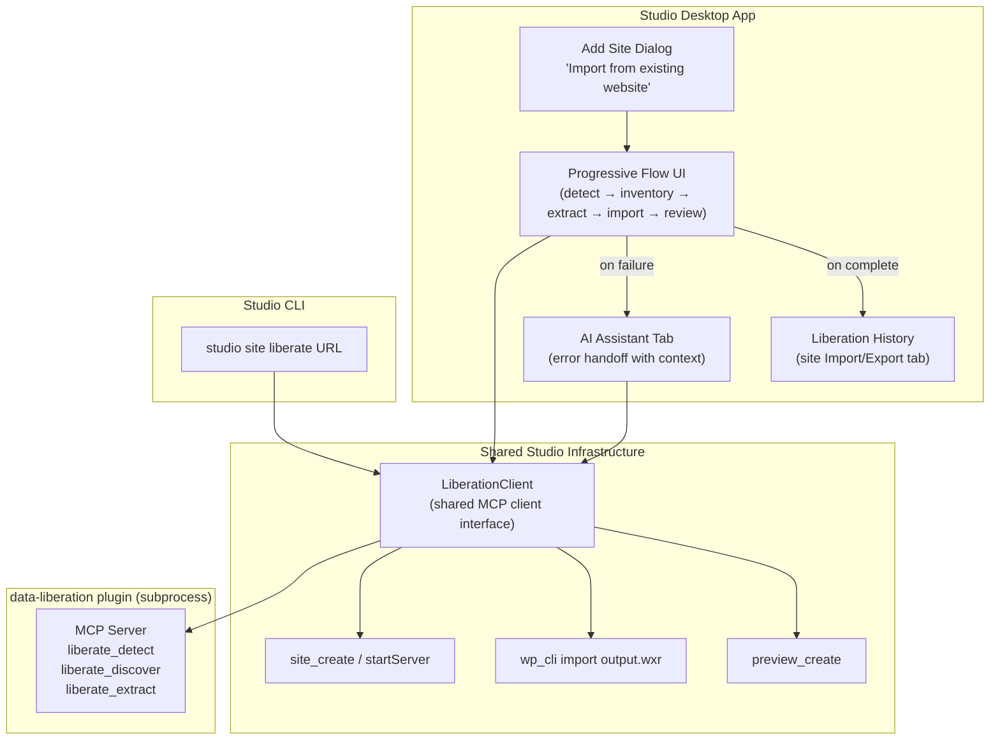
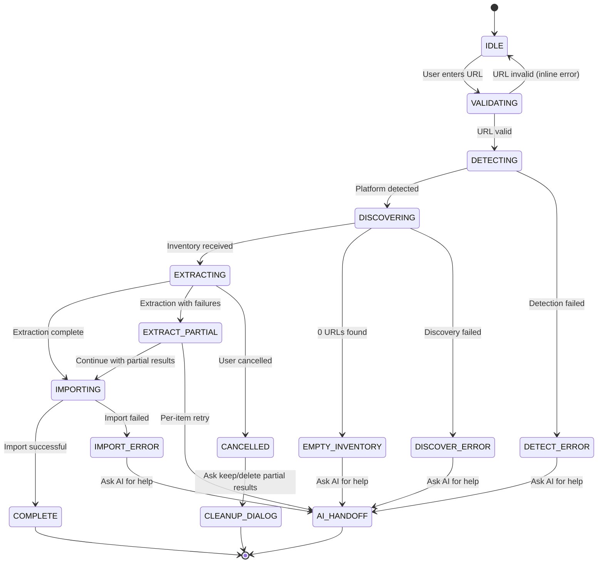
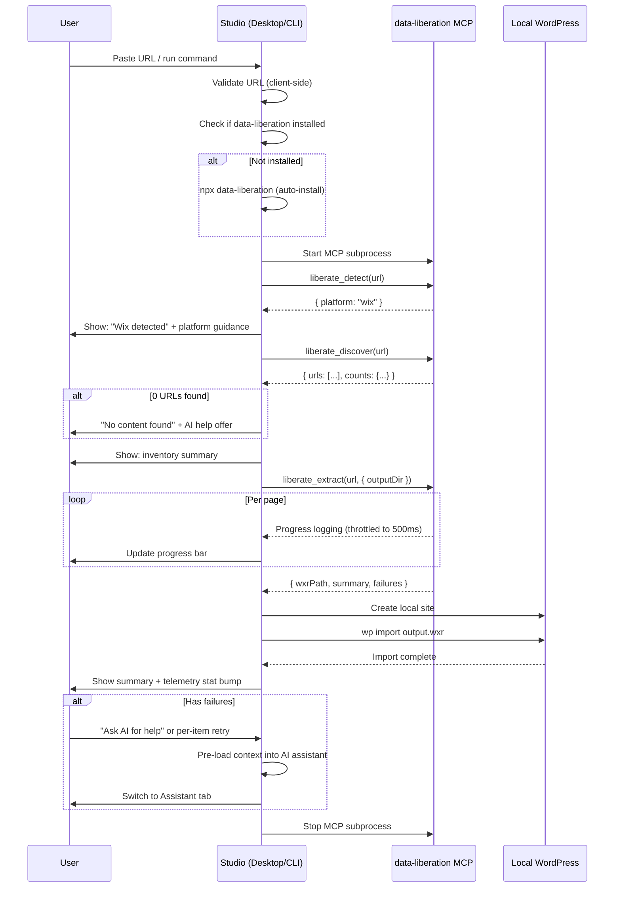

# Studio Liberation Integration Design

## Overview

Integrate data liberation into WordPress Studio — the desktop app, CLI, and AI agent. Users can import content from closed platforms (Wix, Squarespace, Webflow, Shopify) into a local WordPress site through a GUI wizard, a CLI command, or conversationally via the AI assistant.

The core extraction logic lives in the `data-liberation` plugin (see companion spec: `2026-04-03-data-liberation-plugin-design.md`). Studio is the consumer — it calls the plugin's MCP tools, creates the local WordPress site, imports the WXR output, and handles the user-facing experience.

Liberation works without AI at every layer. The AI agent is an enhancement for error recovery and complex cases, not a requirement.

## Decisions

| Decision | Choice | Rationale |
|---|---|---|
| Entry point (desktop) | "Import from existing website" option in Add Site dialog | Liberation is a site creation method — the user wants a new site with existing content. |
| UI pattern | Single-page progressive flow | User sees all steps at once, each reveals as it completes. No Back/Next wizard navigation. |
| CLI command | `studio site liberate <url>` | Distinct operation under the existing `site` namespace. |
| AI involvement | Wizard for happy path, AI handoff on errors | Non-technical users need a deterministic flow. AI helps when things go wrong. |
| Plugin installation | Auto-install on first use via npx | Keeps Studio install size small. Playwright/Chromium (~200MB) only downloaded when needed. |
| MCP server lifecycle | Subprocess, started/stopped per liberation | Not a persistent background service. Runs only during the flow. |
| Output location | Site's `liberation/` subdirectory | Associated with the site. Delete site = delete artifacts. |
| MCP client sharing | Shared `LiberationClient` in `@studio/common` or `apps/cli/lib/` | Both desktop app and CLI need the same MCP subprocess management. DRY. |
| Token handling | `LIBERATION_TOKEN` env var + `--token` flag | Env var avoids exposing token in `ps` process list. Flag still works for convenience. |
| Test mocking | `LiberationClient` interface with injectable mock | Tests inject fixture responses without spawning real subprocesses. |

## Architecture



### Progressive Flow State Machine



## Desktop App — Add Site Dialog

The existing Add Site dialog gains a new section at the bottom: "Import from existing website" with a URL input field. When a URL is entered and the user clicks "Create site", the liberation progressive flow starts instead of creating a blank site. When the URL field is empty, normal site creation proceeds as before.

**URL validation and normalization:**
- Client-side validation on blur/submit: is it a valid URL?
- Auto-add `https://` if protocol is missing
- Strip trailing slashes and whitespace
- Inline error for invalid URLs: "That doesn't look like a URL"
- Disable "Create site" button after first click to prevent double-submit

**Behavior on valid URL entry:**
- Platform detection runs immediately after the URL field loses focus (or after a short debounce)
- A small badge appears next to the field: "Wix detected" / "Squarespace detected" / etc.
- If platform is unknown, the badge shows "Platform not recognized — extraction may be limited"
- The site name field auto-fills from the detected site title (user can override)

## Desktop App — Progressive Flow

After site creation is initiated with a URL, the dialog transitions to the progressive flow. Five steps are shown as a vertical checklist. Each step reveals its result as it completes.

### Steps

**1. Detect platform**
- Auto-completes, no user action
- Shows: "Platform detected: **Wix**" with green checkmark
- Platform-specific guidance appears below: e.g., "Wix sites require a browser for extraction — this may take longer than other platforms" or "Squarespace: your public content will be extracted, no login needed"
- Failure: shows red X with "Could not detect platform" and "Ask AI for help" button (visible only when logged in)

**2. Site inventory**
- Auto-completes after detection
- Shows content counts in a compact grid: pages, posts, images, menu items, categories, tags
- Expandable to show full URL list (collapsed by default)
- Empty state (0 URLs): "No content found at this URL. The site may be empty, require login, or block automated access." with "Ask AI for help" button (if logged in)
- No user confirmation required — extraction starts automatically

**3. Extract content**
- Progress bar with fraction complete (e.g., "31 of 59")
- Current URL shown below the progress bar
- Cancel button available
- On completion: green checkmark. If partial failures: amber warning icon with "extracted with issues"

**4. Import to WordPress**
- Creates the local WordPress site (if not created at step start)
- Runs `wp import` on the WXR file
- Progress indicator (spinner, not a bar — import is fast relative to extraction)
- Green checkmark on completion

**5. Review & publish**
- Summary panel showing what was imported (see Summary Panel States below)
- Action buttons vary by outcome (see below)

### Summary Panel States

**Success (green):**
- All content imported. Shows counts. "All content imported as drafts. Review and publish when ready."
- Buttons: "Open site" (primary) + "Push to WordPress.com" (secondary)

**Partial success (amber):**
- Most content imported. Shows counts + failure details.
- Failure list: first 10 items shown, then "and N more..." expandable
- Per-item retry: each failed item has a retry icon that opens the AI assistant with context scoped to that specific failure
- Notes low quality score pages: "5 pages had low quality scores — review recommended"
- Buttons: "Open site" (primary) + per-item retry icons on failures
- Error details always visible regardless of auth state
- "Ask AI for help" button only shown when user is logged in

**Failure (red):**
- Extraction or import failed entirely.
- Shows error message and details
- Buttons: "Retry" (primary) + "Ask AI for help" (if logged in)

### Cancel Behavior

When the user clicks Cancel during extraction:
- Extraction subprocess is killed
- Confirmation dialog appears: "Keep partial results? You can resume later."
  - **Keep:** Liberation directory and partial JSONL log preserved. Site remains with whatever was imported.
  - **Delete:** Liberation directory cleaned up. If a site was created with no content yet, it's also removed.

### Background Extraction

When the user switches to another site's tab during extraction:
- Extraction continues in the background (MCP subprocess keeps running)
- A subtle spinner/badge appears on the liberating site in the sidebar (with `aria-label="Importing content for [site name]"`)
- When the user switches back, the progressive flow shows current progress
- Progress updates are throttled to ~500ms intervals to avoid excessive React re-renders

### Incomplete Liberation Detection

On Studio launch, check each site for a `.liberation-lock` file in the `liberation/` directory. If found (and the PID in the lock is not running):
- Show a notification: "Your import from [url] was interrupted. Resume?"
- "Resume" button re-starts the liberation flow with `resume: true`
- "Dismiss" removes the lock file but keeps partial results

## Desktop App — Liberation History

After liberation completes, the site's Import/Export tab shows a "Liberation History" section:
- Source URL and platform
- Date of import
- Content counts (pages, posts, images imported)
- Quality score distribution
- Failure count with expandable details
- Data source: reads from `liberation/extraction-log.jsonl` in the site directory

## CLI Command

```
studio site liberate <url> [options]
```

### Options

| Flag | Purpose |
|---|---|
| `--name <name>` | Override site name (default: derived from source site title) |
| `--output-only` | Produce WXR + media only, don't create a WordPress site |
| `--dry-run` | Extract 2-3 pages and report what was found, then stop |
| `--token <token>` | API token for platforms requiring auth (Webflow, Shopify). Also reads `LIBERATION_TOKEN` env var (env var takes precedence to avoid exposing tokens in process list). |
| `--resume` | Resume a previous extraction that was interrupted |
| `--verbose` | Detailed per-page extraction logging |

### Output

```
$ studio site liberate https://mysite.wixsite.com/blog

  Detecting platform... Wix
  Discovering content... 12 pages, 47 posts, 156 images
  Extracting content...
    [████████████████░░░░░░░░░░░░░░] 31/59  /blog/my-first-post
  Importing to WordPress...
    Creating site "mysite"... done
    Importing WXR... done

  ✓ Import complete
    12 pages, 47 posts, 156 images imported as drafts
    Site running at http://localhost:8882

  Next steps:
    studio site start mysite       # if not already running
    studio preview create mysite   # push to WordPress.com
```

### Error output

```
  ⚠ Import completed with issues
    44 of 47 posts imported, 148 of 156 images uploaded
    3 posts failed (timeout): /blog/post-44, /blog/post-45, /blog/post-46
    8 images returned 403

  Run "studio ai" to troubleshoot with the AI assistant.
  Or retry failed items: studio site liberate https://mysite.wixsite.com/blog --resume
```

## AI Agent Integration

### System prompt addition

Studio's `system-prompt.ts` gains a liberation workflow section:

```
## Data Liberation

When the user says "liberate", "import from", or "migrate from" followed by a URL:
1. Use liberate_detect to identify the platform
2. Use liberate_discover to inventory the site, show to user
3. Create a local site with site_create
4. Use liberate_extract to extract content (outputDir: site's liberation/ directory)
5. Import the WXR via wp_cli("import <wxrPath>")
6. Report the summary to the user

When the user is handed off from the liberation wizard with errors:
- The conversation will be pre-loaded with context about what failed
- Use liberate_extract with resume to retry failed URLs
- Use wp_cli to inspect imported content
- Help the user resolve issues conversationally
```

### Error handoff context

When the wizard's "Ask AI for help" button is clicked, Studio switches to the AI assistant tab and pre-loads the conversation with structured context:

```
{
  sourceUrl: "https://mysite.wixsite.com/blog",
  platform: "wix",
  siteName: "mysite",
  sitePath: "/Users/user/.studio/sites/mysite",
  extractionLog: "/Users/user/.studio/sites/mysite/liberation/extraction-log.jsonl",
  wxrPath: "/Users/user/.studio/sites/mysite/liberation/output.wxr",
  redirectMapPath: "/Users/user/.studio/sites/mysite/liberation/redirect-map.json",
  summary: {
    pagesExtracted: 12,
    postsExtracted: 44,
    postsFailed: 3,
    mediaDownloaded: 148,
    mediaFailed: 8,
    failures: [
      { url: "/blog/post-44", error: "timeout" },
      { url: "/blog/post-45", error: "timeout" },
      { url: "/blog/post-46", error: "timeout" }
    ]
  }
}
```

The agent receives this as a system message and can immediately address the specific failures without asking the user to re-explain what happened.

**Per-item retry:** When a user clicks the retry icon on a specific failed item, the AI assistant receives scoped context for just that item — the specific URL, the error, and the extraction options — rather than the entire extraction summary.

### Agent capabilities during liberation

The agent has access to:
- **data-liberation tools** — `liberate_extract` (with resume/specific URLs), `liberate_inspect`, `liberate_detect`
- **Studio tools** — `wp_cli` (inspect/modify imported content), `site_start`/`site_stop`, `take_screenshot`, `preview_create`

This means the agent can:
- Re-extract failed pages with different settings (longer timeout, higher delay)
- Manually fetch content from stubborn URLs and create posts via WP-CLI
- Check the imported site for missing content or broken images
- Help configure redirects from the redirect map
- Push the finished site to WordPress.com when the user is satisfied

## Data Flow



### File locations

Liberation artifacts are stored in the site's directory:

```
~/.studio/sites/mysite/
├── wp-content/          # WordPress files
├── liberation/          # Liberation artifacts
│   ├── output.wxr       # Generated WXR file
│   ├── media/           # Downloaded media files
│   ├── redirect-map.json
│   ├── extraction-log.jsonl
│   └── .liberation-lock # Present during active extraction (PID + timestamp)
└── ...
```

This keeps liberation output associated with the site. Deleting the site cleans up all artifacts.

### MCP server lifecycle

1. Studio checks if `data-liberation` is available (`npx data-liberation --version`)
2. If not installed, runs `npm install -g data-liberation` or uses npx (which caches)
3. Starts MCP server: `npx data-liberation mcp` as a child process with stdio transport
4. Communicates via MCP protocol (same as Studio's existing MCP server pattern)
5. Stops the subprocess when liberation is complete or cancelled

The server is not persistent — it starts when liberation begins and stops when it ends.

## Telemetry

Liberation tracks usage via Studio's existing telemetry (`bump-stat.ts`). Stat bumps at each step transition:

| Event | Stat |
|---|---|
| Liberation started | `liberation_started` |
| Platform detected | `liberation_platform_{wix/squarespace/webflow/shopify/unknown}` |
| Extraction complete | `liberation_extract_success` |
| Extraction partial | `liberation_extract_partial` |
| Extraction failed | `liberation_extract_failed` |
| Import complete | `liberation_import_success` |
| User cancelled | `liberation_cancelled` |
| AI handoff triggered | `liberation_ai_handoff` |
| Resume from incomplete | `liberation_resumed` |

This tells us: how many users attempt liberation, which platforms, success/failure/partial rates, and where users abandon.

## Studio Code Changes

### Shared library

| File | Change |
|---|---|
| `apps/cli/lib/liberation/client.ts` | **New file.** `LiberationClient` interface + real implementation (MCP subprocess management). Shared by desktop app and CLI. |

### Desktop app (apps/studio)

| File | Change |
|---|---|
| `src/hooks/use-add-site.ts` | Add `sourceUrl` to `CreateSiteFormValues`. When set, trigger liberation flow after site creation. |
| Add Site dialog component | Add "Import from existing website" URL field section with validation, platform detection badge. Disable button on click. |
| `src/components/content-tab-liberation.tsx` | **New file.** Progressive flow component with 5 steps, progress tracking, summary panel, per-item retry, cancel dialog, background extraction support. |
| `src/hooks/use-liberation.ts` | **New file.** Hook managing liberation state machine: step progression, progress updates (throttled), error accumulation, cancel/cleanup, incomplete detection on launch. |
| `src/components/content-tab-import-export.tsx` | Add "Liberation History" section showing past import details from JSONL log. |
| `src/stores/chat-slice.ts` | Add action to pre-load liberation error context (full or per-item scoped) into AI assistant conversation. |
| `src/components/content-tab-assistant.tsx` | Handle pre-loaded liberation context (display as system message, not user message). |
| Sidebar site list component | Add liberation-in-progress indicator (spinner/badge) with `aria-label`. |

### CLI (apps/cli)

| File | Change |
|---|---|
| `commands/site/liberate.ts` | **New file.** `studio site liberate <url>` command. Uses shared `LiberationClient`, prints progress, creates site, imports WXR. Reads `LIBERATION_TOKEN` env var. |
| `ai/tools.ts` | Register data-liberation MCP tools as available tools for the AI agent. |
| `ai/system-prompt.ts` | Add liberation workflow section to system prompt. |
| `index.ts` | Register the `liberate` command. |

## Non-technical User Path

The complete non-technical user experience with no AI:

1. Open Studio desktop app
2. Click "Add site"
3. Paste their website URL into "Import from existing website"
4. Click "Create site"
5. Watch the progressive flow complete (1-20 minutes depending on site size)
6. Click "Open site" to review imported content in the browser
7. Click "Push to WordPress.com" to publish

No terminal, no npm, no tokens, no prompts. Seven clicks from "I want to leave Wix" to "my content is on WordPress."

## Future Considerations (Not in v1)

- **Theme matching** — after import, suggest or generate a WordPress theme that visually resembles the source site. Separate project.
- **Redirect configuration UI** — a Studio panel showing the redirect map and helping the user configure their domain's redirects. Currently just a JSON file.
- **Bulk liberation** — support importing multiple sites at once (for agencies or developers managing client sites).
- **WordPress.com direct import** — skip the local site and import directly to WordPress.com via REST API or MCP. Requires the user to have a WordPress.com account.
- **Full auto-resume** — when Studio detects an incomplete liberation on launch, automatically restart the MCP subprocess and resume extraction without user action. More seamless than the notification approach but requires persisting MCP server state and original extraction options.
